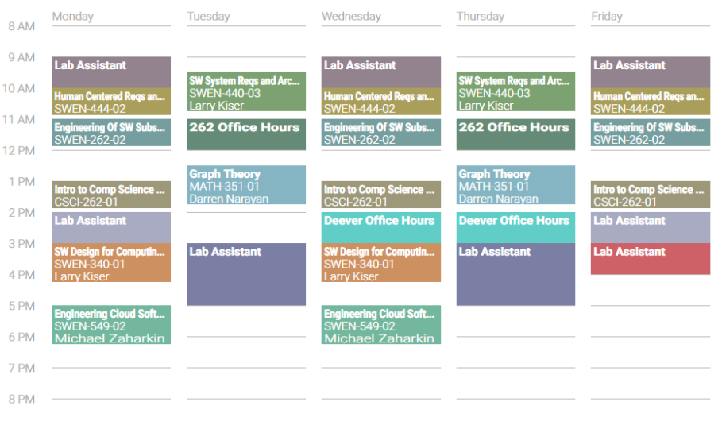
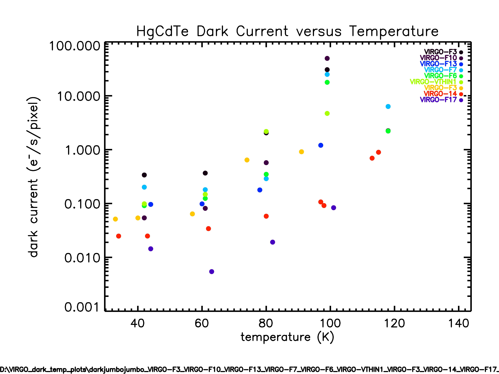
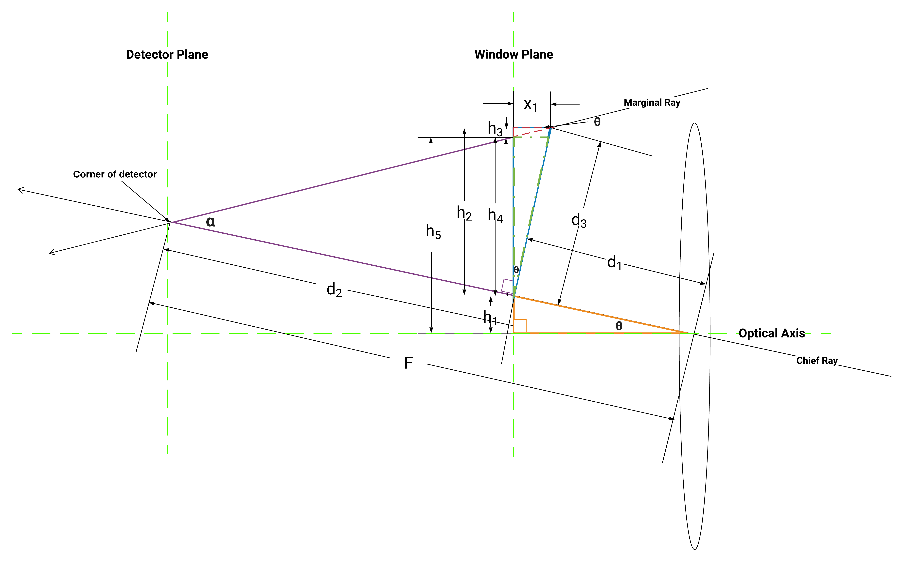

# cfd-lab-assistant
Back in the fall of 2019, I joined the Center for Detectors working as a lab assistant.

Coming from a software background I was put onto the task of helping perform data analysis on existing data. The purpose of this was to make better comparisons for detectors that were being produced. The data analysis involved detector properties, such as dark current.

As I continued working there, I got involved with more technical tasks. This was also one of several endeavors I did that semester. I has a full 18 credit course load and was also a teaching assistant. Working two jobs with such circumstances proved to be challenging. I also flunked my Amazon and Facebook interviews during that semester.

#### Part 1
My first task was to develop a combined plot for various detectors that measured dark current versus temperature. Dark current is a property that measures the amount of residual current in a device after photons have been emitted. This is impacted by the temperature in an exponential relationship. For the purposes of detectors, dark current directly contributes to noise within a detector and must be minimized as much as possible. Below is the resulting plot that I worked on generating.

To generate the image, IDL code was ran on the main server hosting the data sets. IDL was originally written by Harris (now L3Harris) and became the programming language of choice for data visualizations for many areas of imaging and space.

#### Part 2
During this time I also got acquainted with another researcher who was attempting to use a library from Harris into our drivers. I offered consultation in
integrating the C and C++ code together.

The next major task I worked on was important and involved determining if the apparatus that housed the detectors would work at two possible observatories we would be testing at. This involved finding the dimensions of the observatory and the two different apparatus' dimensions. The calculations involved diagramming a lens system and performing ray tracing through the system to determine if all rays would land within the area of the detector. If a ray landed outside of the bounds, this would cause vignetting. There were several calculations to be made and I spent significant time finding the exact dimensions to be certain of the results. The lens system I ended up drawing had some additional dimensions to find using trigonometry.

During this time, I was also tasked with replacing the batteries within an APC regulated power supply. The old batteries had swelled significantly to the point where the frame needed to be dismantled, the batteries taken out, and the frame's rivets replaced. Thanks to John Nash for providing me the tools and assistance for completing this task.

#### Part 3
While I was an assistant, the apparatuses were cooled for testing. The way cooling worked was by using a cryogenic compressor that used water as the coolant. There were several problems with this approach due to our water source not being filtered. Particles would enter the compressor and cause leaks. These leaks would require significant maintenance or ordering a replacement.

There were two leaks during my three month stint. The first was fixed by welding the source of the leak. The second encountered the same point of failure. We ended up ordering another compressor to continue the research promptly.

I was responsible for replacing the compressor. The way the compressor worked involved using helium to rapidly cool the water. In order to replace the compressor, the old compressor needed to be recycled per regulations. This meant I was put in charge of taking the old one apart and reinstalling the new compressor.

There were definitely some late nights put into getting this one done. By the middle of December I was finishing up by hauling the old parts out and throwing them into the outside recycling area as it snowed.
